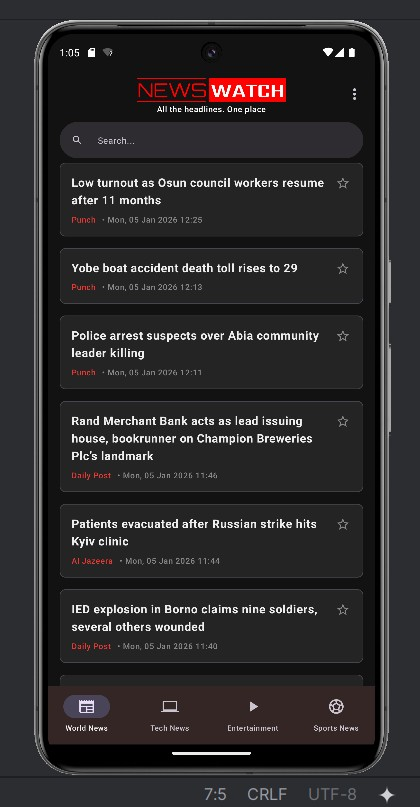
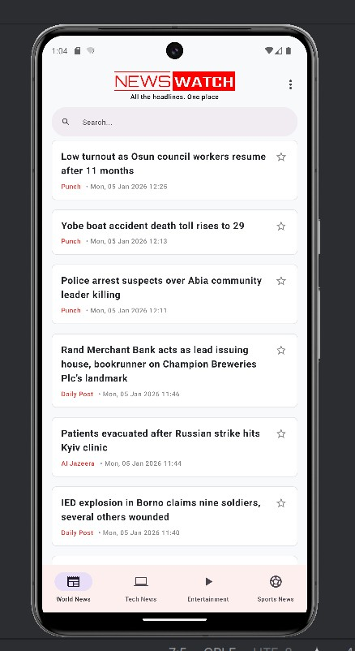

# NewsWatch

NewsWatch is a premium Android application built with Jetpack Compose that aggregates the latest news from various sources in Nigeria and around the world. Stay updated with World News, Tech, Entertainment, and soccer-Centric Sports in one place.

## 📥 Download App
Get the latest version of NewsWatch directly on your Android device:
**[Download NewsWatch APK](https://upload-apk.com/JtcYNqF7u86gd36)**

## Screenshots

<p align="center">
  
  
</p>

## Features

- **Strictly Categorized News**: Browse through **World News**, **Tech**, **Entertainment**, and **Sports**.
- **soccer-Centric Sports**: Dedicated coverage of soccer, including the Nigerian League (NPFL), Super Eagles, AFCON, Champions League, Premier League, and major European leagues.
- **Powerful Search**: Search for news by headline or organization source directly from the main feed.
- **Persistent Bookmarks**: Bookmark your favorite headlines using the star icon. Your bookmarks stay saved even if the news is no longer featured in the main feed (Limit: 20 headlines).
- **Professional Theme Support**: Modern **Dark Mode** (Default) and a clean, professional **Light Mode** that saves your preference.
- **In-App Browsing**: Read full articles directly within the app using a sleek internal WebView.
- **Optimized Data Fetching**: Smart filtering ensures only high-quality, relevant headlines are displayed for each category.

## Tech Stack

- **Language**: [Kotlin](https://kotlinlang.org/)
- **UI Framework**: [Jetpack Compose](https://developer.android.com/jetpack/compose)
- **Networking**: [Retrofit](https://square.github.io/retrofit/)
- **XML Parsing**: [SimpleXML](http://simple.sourceforge.net/)
- **Image Loading**: [Coil](https://coil-kt.github.io/coil/)
- **Local Storage**: SharedPreferences & Gson
- **Concurrency**: [Kotlin Coroutines](https://kotlinlang.org/docs/coroutines-overview.html)

## Getting Started

### Prerequisites

- Android Studio Iguana | 2023.2.1 or newer
- JDK 17
- Android SDK 34 (Target)

### Installation

1. Clone the repository:
   ```bash
   git clone https://github.com/yourusername/newswatch.git
   ```
2. Open the project in Android Studio.
3. Sync Project with Gradle Files.
4. Run the app on an emulator or a physical device.

## App Information

- **Version**: 1.0.1
- **Developer**: Acenet Technology
- **Slogan**: *All the headlines. One place*

## Contact

For support or inquiries, please contact:
- **Phone**: +2348161836558
- **Email**: [ope_adedotun@live.com](mailto:ope_adedotun@live.com)

---
*Powered by Acenet*
